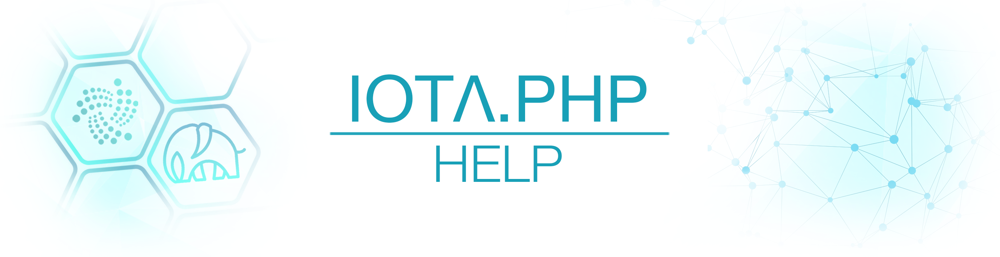
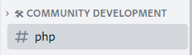

  
  
   
  
  
  <a href="https://www.php.net/" style="text-decoration:none;">= 8.x-blue?style=flat-square&logo=php" alt=">PHP 8"></a>
  
  <a href="https://packagist.org/packages/iota-community/iota.php/" style="text-decoration:none;">packagist_stable"></a>

# About

PHP library to use IOTA REST API to help node management and tangle queries.

> Please be aware that this library is in an early development state and the API of the library as well as the IOTA protocol is subject to change, it is NOT ready to use in production.

This library allows you to do the following:

- [x] Create messages with indexation and transaction payloads
- [x] Get messages and outputs
- [x] Generate addresses
- [x] Interact with an IOTA node
- [x] create Identity
- [x] manipulate Identity
- [x] verify Identity

# Overview

+ [Getting Started](./001_getting_started.md)

+ [Examples (Basics)](./002_examples.md)
    + [Network (testnet|mainnet)](./002_examples_network.md)
    + [Client (info|health|tips)](./002_examples_clientinfo.md)
    + [Milestone (get)](./002_examples_milestone.md)
    + [Peers (get)](./002_examples_peers.md)
    + [Message (send|get|fetch)](./002_examples_message.md)
    + [Address (balance|convert)](./002_examples_balance.md)

+ Examples (Action)
    + [sendTokens](./010_examples_transfer.md)
    + [checkTransaction](./010_examples_checktransaction.md)
    + [getBalance](./010_examples_balance.md)
    + [sendMessage](./010_examples_sendmessage.md)
  

+ Examples (Wallet)
    + [useWallet](./020_examples_wallet.md)
    + [searchWalletAddress](./020_examples_wallet_searchAddress.md)
    + [sendTokens](./020_examples_wallet_sendToken.md)
    + [getHistoricBalances](./020_examples_wallet_getHistoricBalance.md)

+ Examples (Advanced)
    + [Mnemonic](./050_examples_mnemonic.md)
    + ...

+ [Examples (Faucet Client)](./004_examples_faucet.md)
+ [Examples (API)](./003_examples_api.md)

### Identity

+ Examples (Identity)
    + [createIdentity](./060_examples_createIdentity.md)
    + [manipulateIdentity](./060_examples_manipulateIdentity.md)
    + [verifyIdentity](./060_examples_verifyIdentity.md)
  

### Troubleshooting

+ [Troubleshooting](./100_Troubleshooting.md)

___

### Joining the discussion

If you want to get involved in the community, need help with getting set up, have any issues or just want to discuss IOTA, feel free to join
our IOTA [Discord](https://discord.iota.org/) and post in the #php channel.

___

> Follow me on Twitter [@IOTAphp](https://twitter.com/IOTAphp)

___

### Donation

It took me a lot of time to develop **iota.php** and need to pay for the server every month. If you want to support me or if my work helps you, kindly consider a small donation.

