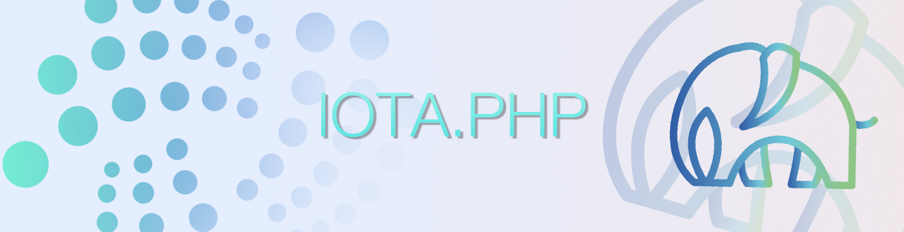

<p align="center">
  <a href="https://discord.iota.org/" style="text-decoration:none;"></a>
  <a href="https://twitter.com/IOTAphp/" style="text-decoration:none;"></a>
  <br>


= 8.x-blue?style=flat-square" alt=">PHP 8">
</p>

# Examples (API)

### Include and create an api client
```php
<?php
  // include iota lib
  require_once("../iota.php");
  // create client
  $client = iota::api('https://api.lb-0.testnet.chrysalis2.com');
```

## node
```php
  $node = $client->node;
  #echo $node->info();
  #echo $node->health();
```
## tangle
```php
  $node = $client->tangle;
  #echo $_client->tangle->tips() . LF;
```
## messages
```php
  $messages = $client->messages;
  #echo $messages->find((string) $index);
  #echo $messages->get((string)$messageId);
  #echo $messages->getMetadata((string)$messageId);
  #echo $messages->getChildren((string)$messageId);
  #echo $messages->getRaw((string)$messageId);
  #$echo messages->submit((\iota\schemas\request\SubmitMessage) $object);
```
## milestones
```php
  $milestones = $client->milestones;
  #echo $milestones->get((string) $index);
  #echo $milestones->utxoChanges((string) $index);
```
## peers
```php
  $peers = $client->peers;
  #echo $peers->get();
  #echo $peers->get((string) $peerId);
```
## utxo
```php
  $utxo = $client->utxo;
  #echo $utxo->find((string) $outputId);
  #echo $utxo->addressEd25519((string) $addressEd25519);
  #echo $utxo->addressesed25519Output((string) $addressEd25519);  
  #echo $utxo->addresses((string) $addressBech32);
  #echo $utxo->addressesOutput((string) $addressBech32);
  #echo $utxo->treasury();
```

<hr>

## Additional Examples
Please find other examples in the [examples](../examples) folder.


___

<- Back to [Overview](000_index.md)